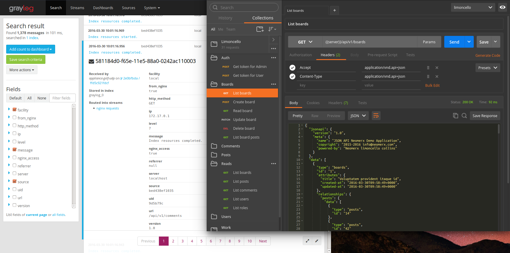

## Quick start JSON API application

Limoncello Collins is a [JSON API](http://jsonapi.org/) quick start application.
 
Technically it is a default [Laravel 5.2](https://github.com/laravel/laravel) application integrated with
- [JSON API implementation](https://github.com/neomerx/json-api)
- Bearer (token-based) Authentication
- Cross-Origin Resource Sharing [CORS for Laravel/Lumen](https://github.com/neomerx/cors-illuminate)

It could be a great start if you are planning to develop API with Laravel.

The application includes
- CRUD operations for a few sample resources with input data validation and [events](https://laravel.com/docs/5.2/events).
- Authentication and authorization support integrated with [policies](https://laravel.com/docs/5.2/authorization).
- Support for such JSON API [features](http://jsonapi.org/format/#fetching) as resource inclusion, sparse field sets, sorting, filtering and pagination.
- JSON API errors.
- API tests.

### Installation

Install [docker-compose](https://docs.docker.com/compose/)

Clone the project

Start local server at [http://localhost:8080](http://localhost:8080) and log server [http://localhost:8090](http://localhost:8080) with

```
$ composer install && composer docker-up
```

> Note: use `$ composer docker-down` to stop the servers.

[](https://app.getpostman.com/run-collection/064046759f3d14d4def7#?env%5Blimoncello%5D=W3sia2V5Ijoic2VydmVyIiwidmFsdWUiOiJodHRwOi8vbG9jYWxob3N0OjgwODAiLCJ0eXBlIjoidGV4dCIsImVuYWJsZWQiOnRydWV9LHsia2V5IjoidG9rZW4iLCJ0eXBlIjoidGV4dCIsInZhbHVlIjoie1wiaWRfdXNlclwiOjEsXCJzZWNyZXRcIjpcIk1KaXpFVnJQUk96Qk83OXZcIn0iLCJlbmFibGVkIjp0cnVlfV0=)



### Questions?

[](https://gitter.im/neomerx/json-api)

### License

This project is a fork from upstream [laravel/laravel](https://github.com/laravel/laravel). All changes to the upstream are licensed under the [MIT license](http://opensource.org/licenses/MIT)

### Versioning

This project is synchronized with upstream `master` branch and uses similar versioning approach.
